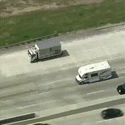
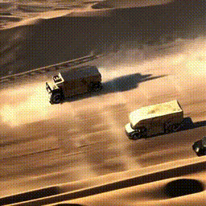
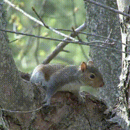
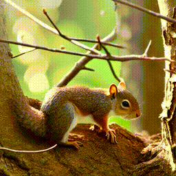
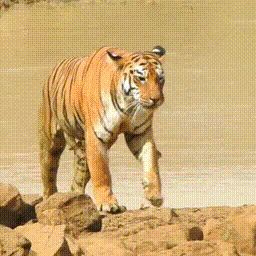
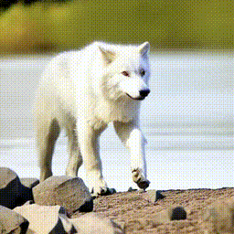

## Gen4Track: A Tuning-free Data Augmentation Framework via Self-correcting Diffusion Model for Vision-Language Tracking (ACM MM 2025)<br><sub>Official Pytorch Implementation</sub>

[Jiawei Ge](https://scholar.google.com/citations?user=5GI4k7cAAAAJ), [Xinyu Zhang](https://github.com/Xinyu-01), Jiuxin Cao, Ioannis Patras, et al.<br>

[**Paper**](https://dl.acm.org/doi/10.1145/3746027.3754956) 

<summary> Abstract </summary>

> *Diffusion models have revolutionized image synthesis, yet their potential for data augmentation in vision-language tracking is limited by challenges in maintaining multi-modal coherence. Gen4Track introduces a tuning-free framework that employs a self-correcting diffusion process to produce diverse, semantically consistent augmented samples. Through iterative corrections, the model aligns visual augmentations with linguistic descriptions, ensuring high-fidelity data for tracking applications. This method enhances tracker robustness in dynamic environments. Our pipeline integrates diffusion generation with correction modules, efficiently handling large-scale datasets. Experiments on standard benchmarks show significant gains in tracking accuracy and generalization over conventional augmentation techniques.*


## Examples

Below are three demonstration examples showcasing the data augmentation process using **Gen4Track**.  Each example includes the edit type, the original video, the edited/augmented video, and the edit prompt used for the self-correcting diffusion process.

| Edit Type | Original Video | Edited Video | Edit Prompt |
| --- | --- | --- | --- |
| **Background** |  |  | A grey armored truck running across a desert wasteland alongside other vehicles. |
| **Style** |  |  | brown squirrel moving among tree branches, fairy tale atmosphere. |
| **Object** |  |  | a white wolf walking by the riverbank. |


## Updates
- [01/2026] Release more examples.
- [01/2026] Code is released.
- [07/2025] Accepted to ACM MM 2025!

## Setup

1. Clone the repository. 

```shell
git clone git@github.com:PeterBishop0/Gen4Track.git
cd Gen4Track
```

2. Create a new conda environment and install PyTorch following [PyTorch Official Site](https://pytorch.org/get-started/locally/). Then pip install required packages.

```shell
conda create -n gen4track python=3.9
conda activate gen4track
# Install torch, torchvision (https://pytorch.org/get-started/locally/)
pip install -r requirements.txt
```

## Editing Guidelines

This framework performs video editing through **video inversion → controlled generation → optional self-correcting refinement**.  
To obtain stable and accurate results, please follow the guidelines below.
Check more config examples in ['configs'](configs). The default config value are specified in ['default.yaml'](configs/default.yaml) with explanation.  


#### Provide Object Bounding Boxes

Object-aware editing requires per-frame bounding box annotations:

```yaml
bbox_path: "path/to/groundtruth.txt"
```

Bounding boxes are used to localize the target object and maintain spatial consistency.
The bounding box file should follow the same frame order as the input video.
Missing or misaligned bounding boxes may cause object drift.

#### Align Inversion and Editing Prompts
The inversion prompt should describe the original video content, while the generation prompt defines the desired edited appearance.

```yaml
inversion:
  prompt: "original object description"

generation:
  prompt: "edited appearance and style"
```
A semantically aligned inversion prompt helps preserve identity and motion.
Large semantic changes should be introduced only in the generation stage.

#### Decide Whether to Use Strong Location Control

```yaml
location_strong_control: False
```
Set **location_strong_control=True** only when modifying attributes of the target object
(e.g., color, texture, or fine-grained appearance). Keep it False when global style or background changes are desired. Using strong location control unnecessarily may suppress natural scene adaptation.
```yaml
phrase: ["detailed object description"]
word: ["object category"]
```
phrase specifies the main object description used for fine-grained control. word indicates the object category.

#### Multi-round Self-correcting Generation

```yaml
self_correcting: True
max_iteration: 2
```
Each iteration evaluates previous results, optimize the prompts and refines the generation accordingly.
For short videos or simple edits, a single generation round is often sufficient.

## Run

```shell
python run_generation.py --config configs/squirrel.yaml
```

For source data to be edited (e.g., input data examples), refer to the ['examples'](examples) directory. Outputs will be saved in ['outputs'](outputs).

## Citation

If you find this work useful for your research, please consider citing our paper:

```bibtex

@inproceedings{ge2025gen4track,
  title={Gen4Track: A Tuning-free Data Augmentation Framework via Self-correcting Diffusion Model for Vision-Language Tracking},
  author={ Ge, Jiawei and Zhang, Xinyu and Cao, Jiuxin and Zhu, Xuelin and Liu, Weijia and Gao, Qingqing and Cao, Biwei and Wang, Kun and Liu, Chang and Liu, Bo and Feng, Chen and Patras, Ioannis},
  booktitle={Proceedings of the 33rd ACM International Conference on Multimedia (MM '25)},
  year={2025},
}

```

## Acknowledgments

The code is mainly developed based on [Diffusers](https://github.com/huggingface/diffusers),[VidToMe](https://github.com/lixirui142/VidToMe).
